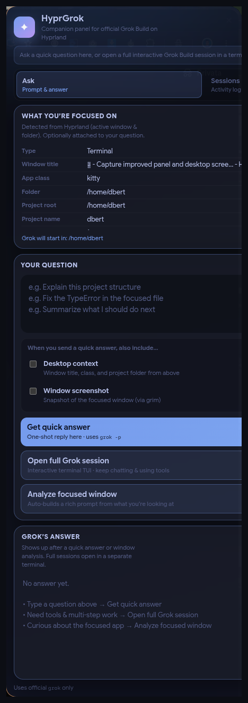
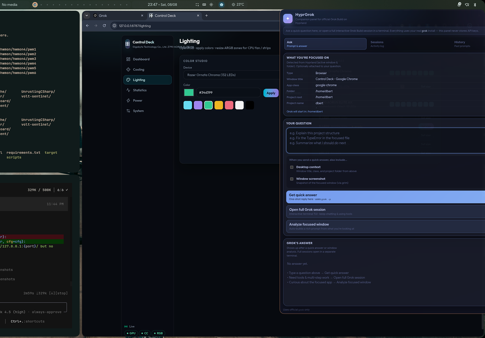

# HyprGrok

**Grok Build, made for Hyprland.**

[](LICENSE)
[](https://www.python.org/)
[](https://hyprland.org/)
[](CHANGELOG.md)

HyprGrok is a lightweight **Hyprland companion** for the official [**Grok Build**](https://github.com/xai-org) `grok` CLI.

It does **not** call the xAI API and never stores API keys.  
Authentication, models, and agent capabilities stay with official Grok Build.  
HyprGrok only **launches, resumes, and enhances** real `grok` sessions with desktop awareness and a glass panel UI.

---

## Screenshots

<p align="center">
  
</p>

<p align="center">
  
</p>

| Control | Purpose |
|---------|---------|
| **What you're focused on** | Active app / folder from Hyprland (the panel itself is ignored) |
| **Get quick answer** | One-shot reply in the panel (`grok -p`) |
| **Open full Grok session** | Interactive TUI in your terminal |
| **Analyze focused window** | Auto-builds a rich prompt from the focused app |
| **Sessions / History** | Real data from `~/.grok/sessions` + resume |

Default toggle: **`Super + Space`**

---

## Why HyprGrok?

Running `grok` in a terminal works. HyprGrok adds what a tiling desktop users actually want:

- One keybind → polished floating panel  
- Desktop context (window, project root, optional screenshot)  
- Browse and **resume** real Grok Build sessions  
- Status chip for **Quickshell** (Illogical Impulse) or **Waybar**  
- Install / uninstall that is clearly marked and reversible  

---

## Requirements

| Required | Optional |
|----------|----------|
| [Hyprland](https://hyprland.org/) | `grim` (screenshots) |
| Python **3.12+** | Chrome / Chromium / Firefox (panel UI) |
| Official **Grok Build** (`grok` on PATH) | `kitty` / `foot` / `alacritty` / … |
| | Waybar **or** Quickshell (status bar) |

---

## Install

### Clone (recommended)

```bash
git clone https://github.com/dcbert/hyprgrok.git
cd hyprgrok
./install.sh
```

### One-liner

```bash
curl -fsSL https://cdn.jsdelivr.net/gh/dcbert/hyprgrok@main/install.sh | bash
```

> Prefer **jsDelivr** over `raw.githubusercontent.com` — GitHub’s raw CDN can lag after updates.

### Options

```bash
./install.sh --no-hyprland   # skip keybinds / window rules
./install.sh --prefix ~/.local
./install.sh --force         # overwrite ~/.config/hyprgrok/config.toml
```

Piped with flags:

```bash
curl -fsSL https://cdn.jsdelivr.net/gh/dcbert/hyprgrok@main/install.sh | bash -s -- --no-hyprland
```

The installer will:

1. Check for Python / `grok` / browser / Hyprland tools  
2. Install to `~/.local/share/hyprgrok` + `~/.local/bin/hyprgrok`  
3. Create `~/.config/hyprgrok/config.toml`  
4. Append **clearly marked** Hyprland binds & rules (`BEGIN/END HYPRGROK`)  
5. Wire a Quickshell bar button when Illogical Impulse is detected  

Ensure `~/.local/bin` is on your shell `PATH` (Hyprland binds use the absolute path either way).

### Uninstall

```bash
hyprgrok-uninstall
# or
./uninstall.sh --purge   # also remove config/state
```

---

## Keybinds (defaults)

| Bind | Action |
|------|--------|
| **`Super + Space`** | Toggle glass panel |
| `Super + Shift + G` | Full interactive Grok session |
| `Super + Alt + G` | Print desktop context |
| `Super + Ctrl + G` | Analyze focused window |

> **Note:** Illogical Impulse already uses `Super + G` for its widget overlay, so HyprGrok defaults to **`Super + Space`**.

---

## CLI

```bash
hyprgrok                 # same as toggle
hyprgrok toggle          # open / close panel
hyprgrok doctor          # dependency check
hyprgrok ask "…" -c      # headless prompt (+ context)
hyprgrok session         # full TUI in project folder
hyprgrok ask-window      # analyze focused window
hyprgrok context --json  # dump desktop context
hyprgrok sessions        # list Grok Build sessions (~/.grok)
hyprgrok sessions --resume <id>
hyprgrok history         # prompt history from Grok Build
hyprgrok status          # human status
hyprgrok status --waybar # JSON for status bars
hyprgrok hypr snapshot   # compact Hyprland snapshot
```

---

## Configuration

`~/.config/hyprgrok/config.toml`

```toml
grok_binary = "grok"
notify_on_complete = true

[panel]
position = "right"
width = 560
height = 980
port = 8765
auto_inject_context = false
browser = "auto"

[launch]
terminal = "auto"
preferred_terminals = ["kitty", "foot", "alacritty", "wezterm", "ghostty"]
headless_timeout_sec = 300
```

Theme colors live under `[theme]`.  
**No xAI keys are ever written here** — sign in with `grok login` if needed.

Window size/position is controlled by Hyprland rules (see `configs/hyprland/`), so the panel stays fully on-screen.

---

## Status bar

### Quickshell (Illogical Impulse)

After install you should get a **robot** chip on the bar:

| Click | Action |
|-------|--------|
| Left | Toggle panel |
| Right | Full Grok session |
| Middle | Analyze focused window |

Details: [docs/QUICKSHELL.md](docs/QUICKSHELL.md)

### Waybar

```bash
hyprgrok status --waybar
```

Snippet: [`configs/waybar/hyprgrok.jsonc`](configs/waybar/hyprgrok.jsonc) · [docs/WAYBAR.md](docs/WAYBAR.md)

---

## How it works

```
┌─────────────────────────────────────────────┐
│                 HyprGrok                    │
│  Glass Panel (HTML)  ←→  Panel server       │
│         │                (localhost only)   │
│         │         ┌──────┴──────┐           │
│         │         │ Context     │           │
│         │         │ (hyprctl)   │           │
│         │         └──────┬──────┘           │
│         │    Sessions / history from        │
│         │         ~/.grok/sessions          │
└─────────┼────────────────┬──────────────────┘
          │                │
          └───────►  Official `grok` CLI
                     (auth, models, tools)
```

- **Quick answers:** `grok -p "…"`  
- **Full sessions:** interactive TUI in a terminal  
- **Resume:** `grok --resume <session-id>`  
- Panel HTTP API binds **`127.0.0.1` only**

---

## Troubleshooting

| Problem | Fix |
|---------|-----|
| Keybind does nothing | Run `hyprctl reload`. Confirm binds in `~/.config/hypr/custom/keybinds.lua` (or conf sources). Default is **Super+Space**, not Super+G. |
| Panel doesn’t open | `hyprgrok doctor` · `hyprgrok toggle` · check `~/.config/hyprgrok/panel.log` |
| “Focused on” shows HyprGrok | Update to latest — panel windows are skipped via focus history |
| Panel off-screen | Update rules (fixed 560px width + `monitor_w-576` move). Close and reopen the panel. |
| No bar icon | Illogical Impulse: Settings → Bar → HyprGrok, then `killall qs; qs -c ii &` |
| Grok missing | Install official Grok Build so `grok` is on PATH (`hyprgrok doctor`) |

---

## Development

```bash
git clone https://github.com/dcbert/hyprgrok.git
cd hyprgrok
export PYTHONPATH=.
python3 -m hyprgrok doctor
python3 -m unittest discover -s tests -v
./install.sh
```

Docs:

| Doc | Topic |
|-----|--------|
| [docs/TECH_SPEC.md](docs/TECH_SPEC.md) | Architecture & API |
| [docs/QUICKSHELL.md](docs/QUICKSHELL.md) | II / Quickshell bar |
| [docs/WAYBAR.md](docs/WAYBAR.md) | Waybar module |
| [docs/ACP.md](docs/ACP.md) | Future ACP notes |
| [CHANGELOG.md](CHANGELOG.md) | Release history |
| [CONTRIBUTING.md](CONTRIBUTING.md) | How to contribute |

---

## Security & privacy

- No xAI API keys handled or stored by HyprGrok  
- Panel server listens on **localhost only**  
- Reads Grok session metadata under `~/.grok/sessions` (read-only)  
- Screenshots stay local (`~/.cache/hyprgrok/`) unless you attach them in a Grok session yourself  

See [SECURITY.md](SECURITY.md).

---

## License

[MIT](LICENSE) © HyprGrok contributors.

**Not affiliated with xAI.**  
Grok Build is the official CLI; HyprGrok is an independent open-source companion for Hyprland.
